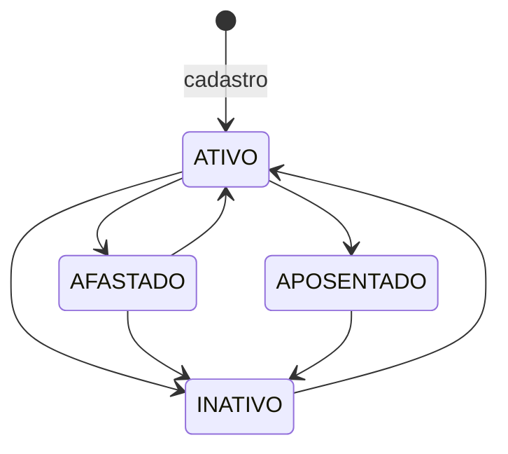

# Sindesk
 
**Plataforma SaaS multi-tenant de gestão sindical.** Back-end em Node.js, TypeScript e PostgreSQL.
 


 
**[🔗 API em produção](https://sindesk-api-ee86.onrender.com)** · **[📘 Documentação Swagger](https://sindesk-api-ee86.onrender.com/api/v1/docs)** · [Credenciais de demonstração](#experimente)
 
> 📌 Este é o repositório de **apresentação técnica** do Sindesk. O código-fonte é privado, por se tratar de um produto em comercialização. Aqui estão a arquitetura, o modelo de dados, o contrato da API, a rastreabilidade entre regra de negócio e teste, e uma instância pública para você testar a API você mesmo.
> Código disponível para avaliação técnica mediante solicitação: **alan360gabriel@gmail.com**
 
---
 
## O problema
 
Sindicatos e associações de classe administram a base de filiados em planilhas. Na prática, isso significa:
 
- cadastros duplicados, porque nada impede o mesmo CPF de entrar duas vezes;
- vigências de filiação vencendo sem que ninguém perceba;
- nenhum histórico de quem alterou o quê — quando um cadastro muda, a informação anterior simplesmente desaparece;
- nenhum indicador confiável para a diretoria tomar decisão;
- dado pessoal de milhares de trabalhadores circulando em arquivos soltos, sem controle de acesso e sem rastreabilidade.
O último item deixou de ser inconveniência operacional e virou exposição jurídica com a LGPD.
 
## A solução
 
Um back-end multi-tenant onde cada entidade sindical opera sobre uma base única, isolada das demais, com controle de acesso por perfil, histórico de alterações e trilha de auditoria de toda operação de escrita.
 
**Uma instância, muitos sindicatos, zero possibilidade de um enxergar o outro.** Essa frase é o requisito central do produto e organizou praticamente todas as decisões técnicas abaixo.
 
---
 
## Demonstração
 

 
---
 
## Experimente
 
A instância de demonstração tem **dois sindicatos distintos**, propositalmente. Faça login com um e tente alcançar os dados do outro.
 
Senha para todos os usuários: `Demo@1234`
 
| Sindicato | Perfil | E-mail |
| :--- | :--- | :--- |
| Metalúrgicos do DF | ADMIN | `admin@metalurgicos.org.br` |
| Metalúrgicos do DF | SECRETARIO | `secretario@metalurgicos.org.br` |
| Metalúrgicos do DF | ASSISTENTE | `assistente@metalurgicos.org.br` |
| Metalúrgicos do DF | TESOUREIRO | `tesoureiro@metalurgicos.org.br` |
| Comerciários de Brasília | ADMIN | `admin@comerciariosdf.org.br` |
 
> Ambiente de demonstração com dados fictícios gerados por seed. Os CPFs são matematicamente válidos e não correspondem a pessoas reais.
> Plano `free` do Render: a primeira requisição após período de inatividade pode levar cerca de 30 segundos (cold start). Se a API não responder de imediato, é isso — e não o sistema.
 
O Swagger tem o botão **Authorize** configurado — dá para autenticar e testar todos os endpoints direto no navegador, sem Postman.
 
**Sugestão de roteiro:** autentique como `admin@metalurgicos.org.br`, liste os filiados e copie o `id` de um deles. Depois autentique como `admin@comerciariosdf.org.br` e tente `GET /api/v1/filiados/{id}` com aquele ID. A resposta é `404`, não `403` — e o motivo dessa escolha está descrito mais abaixo.
 
---
 
## Stack
 
| Camada | Escolha |
| :--- | :--- |
| Runtime | Node.js 24 (LTS) |
| Linguagem | TypeScript ^6 |
| Framework web | Express ^5 |
| Banco | PostgreSQL 15+ |
| Acesso a dados | Prisma ORM ^7 (driver adapter `@prisma/adapter-pg`) |
| Validação | Zod ^4 |
| Autenticação | JWT (HS256, 8h) + bcryptjs (custo 12 em produção) |
| Proteção de dado pessoal | CPF cifrado em repouso — HMAC-SHA256 (busca/unicidade) + AES-256-GCM (exibição), chaves separadas |
| Documentação | OpenAPI 3.0 gerado a partir dos schemas Zod + Swagger UI |
| Testes | Vitest + Supertest, contra PostgreSQL real em container |
| Ambiente | Docker + Docker Compose |
| CI | GitHub Actions |
| Deploy | Render (Blueprint via `render.yaml`) + PostgreSQL gerenciado (Neon) |
 
---
 
## Arquitetura — as decisões que importam
 
Cada decisão abaixo tinha alternativas viáveis. O que segue é o que foi escolhido, por quê, e qual preço veio junto.
 
### 1. Multi-tenancy por discriminador, não por schema ou banco separado
 
**Alternativas:** um banco por sindicato; um schema PostgreSQL por sindicato; uma coluna discriminadora `sindicato_id` em todas as tabelas.
 
Banco por tenant dá o isolamento mais forte, mas cada novo cliente vira provisionamento de infraestrutura e cada migração roda N vezes — o custo operacional inviabiliza antes do décimo cliente. Schema por tenant fica no meio-termo, mas ainda multiplica migrações.
 
**Escolhido:** coluna discriminadora. Menor custo operacional, maior facilidade de evolução. **O preço é claro: o isolamento passa a depender de disciplina de aplicação, não de fronteira física.** Um `WHERE` esquecido vaza dados. As decisões seguintes existem para pagar esse preço.
 
### 2. O invariante do sistema
 
> `sindicatoId` vem exclusivamente das claims do JWT — nunca do corpo, da query string, de um header ou de um parâmetro de rota.
 
Todo método de repositório que toca uma tabela com `sindicato_id` recebe `sindicatoId` como **primeiro parâmetro obrigatório**. Esquecer o filtro de tenant vira erro de compilação do TypeScript, não bug em produção.
 
Há ainda uma **segunda barreira, redundante de propósito**: os schemas Zod dos DTOs operam em modo `strip`. Nenhum DTO declara `sindicatoId`, então um cliente que injete esse campo no corpo tem o valor descartado na validação, antes de chegar ao service. As duas defesas protegem o mesmo invariante por caminhos independentes.
 
A única exceção deliberada é `findManyByEmailAcrossTenants` — o login não tem como saber o tenant antes de autenticar, porque e-mail é único por sindicato, não globalmente. A função diz isso no próprio nome; o `sindicatoId` do token emitido vem sempre da linha já autenticada no banco.
 
### 3. 404, nunca 403, entre tenants
 
Um filiado que existe mas pertence a outro sindicato devolve `404 RESOURCE_NOT_FOUND`. Um `403` confirmaria a existência do registro para quem não deveria nem saber que ele existe, permitindo enumeração por iteração de IDs.
 
### 4. Auditoria transacional
 
Toda escrita em `filiados` grava também em `audit_logs`, **na mesma transação**. Se a auditoria falhar, a operação inteira sofre rollback — um registro sem rastro de auditoria é pior do que nenhum registro, porque produz alteração sem responsável, que é exatamente o cenário que a LGPD existe para evitar.
 
### 5. Prisma para CRUD, SQL cru para agregação
 
O CRUD usa Prisma: tipagem derivada do schema, migrações versionadas, menos repetição. As métricas do dashboard e os cálculos do espelho de cobrança usam SQL escrito à mão, com agregação condicional numa única varredura — expressar isso com ORM produziria múltiplas consultas separadas.
 
Todo SQL cru usa `Prisma.sql` com template parametrizado: o `sindicatoId` vira *bind parameter*, não concatenação de string. SQL cru sem risco de injeção é uma escolha repetida em cada ponto, não um acidente relaxado com o tempo.
 
### 6. Unicidade de CPF garantida no banco, não só na aplicação
 
A verificação prévia em código existe para devolver erro claro, mas tem condição de corrida. A garantia real é a constraint `UNIQUE (sindicato_id, cpf_hash)` no banco. A aplicação captura a violação (`23505`) e converte no mesmo `409 DUPLICATE_CPF`, em vez de deixar virar `500`. A constraint é composta com o tenant — o mesmo CPF pode existir em dois sindicatos diferentes.
 
### 7. CPF cifrado em repouso, com busca exata preservada
 
Guardar CPF em texto plano é risco desnecessário. As duas soluções óbvias isoladas não bastam: só hash perde a exibição; só cifra com vetor aleatório perde a busca exata.
 
A solução usa as duas para propósitos diferentes: HMAC-SHA256 sustenta unicidade e busca; AES-256-GCM com vetor aleatório por gravação é usada só para exibição — com chave separada da chave de hash, para que comprometer uma não comprometa a outra. O contrato de API não muda: o CPF continua sendo recebido e devolvido em texto claro pelo cliente.
 
### 8. Imutabilidade de auditoria por privilégio de banco, não por convenção
 
A aplicação roda em produção com uma role de runtime sem `UPDATE`/`DELETE` sobre a tabela `audit_logs`. Só a role dona do schema — usada exclusivamente por migração — teria esse privilégio, e ela nunca executa código da aplicação.
 
Isso muda a garantia de "nenhuma rota expõe `UPDATE`/`DELETE`" (convenção que um código futuro poderia violar por engano) para "o próprio banco recusa a operação, mesmo com bug de aplicação".
 
### 9. Rate limiter com estado compartilhado no Postgres
 
Um rate limiter em memória não sobrevive a restart e não funciona corretamente atrás de múltiplas instâncias — cada instância teria seu próprio contador. A contagem vive numa tabela própria no Postgres, compartilhada por qualquer instância da API, sem depender de Redis adicional na infraestrutura.
 
### 10. Documentação que quebra o build quando diverge do código
 
O documento OpenAPI é gerado a partir dos próprios schemas Zod, e um teste de integração valida o resultado contra o schema OpenAPI 3.0 nos dois sentidos: rota sem documentação falha, documentação sem rota também. Documentação mantida à mão diverge do código em semanas. Aqui, divergir derruba o CI.
 
### 11. Exportação em massa é uma permissão diferente de listar
 
O endpoint de relatórios — exportação completa em CSV/JSON — é mais restrito por perfil do que a listagem paginada: só dois dos quatro perfis exportam, mas todos continuam consultando os mesmos dados um registro por vez. A decisão trata exportação em massa como uma superfície de risco diferente (exfiltração de dado pessoal em volume), não o dado em si como mais protegido para uns perfis do que para outros.
 
---
 
## Modelo de dados
 
```mermaid
erDiagram
    sindicatos ||--o{ usuarios : "possui"
    sindicatos ||--o{ filiados : "possui"
    sindicatos ||--o{ audit_logs : "registra"
    filiados   ||--o{ historico_status : "possui"
    filiados   ||--o{ vinculos_profissionais : "possui"
    filiados   ||--o{ historico_movimentacoes : "possui"
    usuarios   ||--o{ historico_status : "executa"
    usuarios   ||--o{ historico_movimentacoes : "registra"
    usuarios   ||--o{ audit_logs : "executa"
 
    sindicatos { uuid id PK; string nome; string cnpj UK }
    usuarios { uuid id PK; uuid sindicato_id FK; string email; string senha_hash; enum perfil }
    filiados { uuid id PK; uuid sindicato_id FK; string nome_completo; string cpf_hash; string cpf_cifrado; enum status_cadastral; date data_vigencia_fim; timestamptz anonimizado_em }
    vinculos_profissionais { uuid id PK; uuid sindicato_id FK; uuid filiado_id FK; string empresa_nome; enum status_vinculo }
    historico_movimentacoes { uuid id PK; uuid sindicato_id FK; uuid filiado_id FK; enum tipo_movimentacao }
    historico_status { uuid id PK; uuid sindicato_id FK; uuid filiado_id FK; enum status_anterior; enum status_novo; string motivo }
    audit_logs { uuid id PK; uuid sindicato_id FK; uuid usuario_id FK; string acao; jsonb dados_anteriores; jsonb dados_novos }
```
 
Toda tabela de dados de negócio carrega `sindicato_id NOT NULL` — é o que torna o invariante verificável por inspeção do schema. `filiados` não tem mais coluna `cpf` em texto plano: `cpf_hash` e `cpf_cifrado` são a única forma de armazenamento desde a migração de LGPD.
 
---
 
## API
 
Base: `/api/v1`. Contrato completo no [Swagger](https://sindesk-api-ee86.onrender.com/api/v1/docs).
 
**MVP (Fases 1–3)**
 
| Método | Rota | Perfis |
| :--- | :--- | :--- |
| `GET` | `/health` | público |
| `POST` | `/auth/login` | público |
| `GET` | `/auth/me` | todos |
| `POST` | `/filiados` | ADMIN, SECRETARIO |
| `GET` | `/filiados` | todos |
| `GET` | `/filiados/:id` | todos |
| `PUT` | `/filiados/:id` | ADMIN, SECRETARIO |
| `PATCH` | `/filiados/:id/status` | ADMIN, SECRETARIO |
| `PATCH` | `/filiados/:id/renovar-vigencia` | ADMIN, SECRETARIO |
| `GET` | `/filiados/vencimentos-proximos` | todos |
| `POST` | `/filiados/:id/vinculos` | ADMIN, SECRETARIO |
| `GET` | `/filiados/:id/vinculos` | todos |
| `POST` | `/filiados/:id/anonimizar` | ADMIN |
| `GET` | `/dashboard/metrics` | ADMIN, TESOUREIRO |
| `GET` | `/reports/filiados` (json\|csv) | ADMIN, TESOUREIRO |
 
**Fase 4 — Arrecadação e conciliação (parcialmente entregue)**
 
| Método | Rota | Perfis |
| :--- | :--- | :--- |
| `POST` / `GET` | `/empresas` | ADMIN, SECRETARIO / todos |
| `GET` / `PUT` | `/empresas/:id` | todos / ADMIN, SECRETARIO |
| `PATCH` | `/empresas/:id/status` | ADMIN |
| `POST` / `GET` | `/planos-contribuicao` | ADMIN / ADMIN, TESOUREIRO |
| `POST` / `GET` | `/planos-contribuicao/:id/valores` | ADMIN / ADMIN, TESOUREIRO |
| `GET` / `PATCH` | `/sindicato/plano-padrao` | ADMIN, TESOUREIRO / ADMIN |
| `PATCH` | `/filiados/:id/plano-contribuicao` | ADMIN, SECRETARIO |
| `GET` | `/cobrancas/espelho` | ADMIN, TESOUREIRO |
| `GET` | `/empresas/:id/espelho` | ADMIN, TESOUREIRO |
| `GET` | `/reports/espelho` (json\|csv) | ADMIN, TESOUREIRO |
| `POST` / `GET` | `/recebimentos` | ADMIN, TESOUREIRO |
| `POST` | `/recebimentos/:id/estorno` | ADMIN |
| `POST` | `/recebimentos/importacao` | ADMIN, TESOUREIRO |
| `POST` | `/recebimentos/importacao/:loteId/confirmar` | ADMIN, TESOUREIRO |
| `GET` | `/conciliacao` | ADMIN, TESOUREIRO |
| `GET` | `/conciliacao/evolucao` | ADMIN, TESOUREIRO |
| `PATCH` | `/sindicato/tolerancia` | ADMIN |
| `GET` | `/reports/conciliacao` (json\|csv) | ADMIN, TESOUREIRO |
| `GET` / `PATCH` | `/sindicato/pix` | ADMIN, TESOUREIRO / ADMIN |
| `GET` | `/empresas/:id/pix` | ADMIN, TESOUREIRO |
 
### Perfis de acesso
 
| Perfil | O que faz |
| :--- | :--- |
| `ADMIN` | Acesso total ao sindicato |
| `SECRETARIO` | Cadastro, edição e mudança de status de filiados |
| `ASSISTENTE` | Somente consulta |
| `TESOUREIRO` | Consulta, relatórios e indicadores gerenciais |
 
### Máquina de estados do filiado
 

 
---
 
## Rastreabilidade — regra de negócio → implementação → teste
 
| Regra | Implementação | Teste |
| :--- | :--- | :--- |
| RN-AUTH-01 (bcrypt custo 12, parametrizado por `BCRYPT_ROUNDS`) | `auth.service.ts` | Exercitado por todo teste de login |
| RN-AUTH-02 (e-mail único por sindicato; ambiguidade resolvida via `300 Multiple Choices`) | `auth.service.ts#autenticar` | `auth.spec.ts` — "e-mail duplicado entre sindicatos" |
| RN-AUTH-05 (rate limiter com store no Postgres) | `postgresRateLimitStore.ts` | `rate-limiter.spec.ts` — 2ª instância também recebe `429` |
| RN-FIL-01 (CPF: sanitização, módulo 11, sequências repetidas) | `shared/utils/cpf.ts` | `cpf.spec.ts` (11 casos) + integração |
| RN-FIL-02 (unicidade por sindicato: pré-checagem + constraint) | `filiados.repository.ts#createWithAudit` | Duplicado (409) e mesmo CPF em tenant diferente (201) |
| RN-FIL-03 (matriz de transição de status) | `shared/utils/transicaoStatus.ts` | `transicao-status.spec.ts` — matriz 4×4 completa + integração |
| RN-FIL-05 (`PUT` como substituição total) | `filiados.service.ts` | `filiados.spec.ts` — "campo omitido, antes preenchido, é gravado como null" |
| RN-ASS-02/03 (vínculo `ATUAL` único, banco + aplicação) | `vinculos.service.ts` + índice único parcial | `vinculos.spec.ts` — 2ª abertura fecha a 1ª |
| RN-AUD-01 (rollback se a auditoria falhar) | `filiados.repository.ts#createWithAudit` | `filiados.spec.ts` — "falha forçada na gravação da auditoria" |
| RN-AUD-05 (imutabilidade de `audit_logs` por privilégio de banco) | `scripts/provisionar-role-runtime.sql` | `role-restrita.spec.ts` — `UPDATE`/`DELETE` falham com `42501` |
| RN-REL-01/02 (relatório restrito; teto de 10.000 linhas) | `reports.service.ts` | `reports.spec.ts` — 403 para demais perfis; teto rejeitado antes de tocar qualquer linha |
| RN-LGPD-01 (CPF cifrado em repouso) | `shared/security/cpfCripto.ts` | `cpfCripto.spec.ts` + `filiados.spec.ts` (cifrado ≠ texto claro) |
| RN-LGPD-02 (direito ao esquecimento, idempotente) | `filiados.service.ts#anonimizarFiliado` | `anonimizacao.spec.ts` |
| RN-LGPD-03 (política de retenção de dados) | `scripts/aplicar-politica-retencao.ts` | `politica-retencao.spec.ts` |
| **Isolamento multi-tenant** (o invariante do sistema) | `tenantMiddleware.ts` + tenant em todo repositório | `isolamento-multi-tenant.spec.ts` — todas as rotas que tocam dado de tenant |
| RBAC (introspecção real das rotas montadas) | `shared/security/rbac.ts` + `rbacMiddleware.ts` | `rbac-matriz.spec.ts` |
| OpenAPI não diverge das rotas reais | `shared/docs/*.openapi.ts` | `openapi.spec.ts` |
 
---
 
## Testes
 
Suíte em Vitest + Supertest, executada contra **PostgreSQL real em container** — não mock, não SQLite. O valor central do sistema depende de constraints, índices e cláusulas `WHERE`; um banco simulado testaria a simulação.
 
O primeiro teste escrito foi o de isolamento entre tenants, e ele verifica quatro superfícies (hoje estendido para toda rota que toca dado de tenant):
 
```ts
it('não expõe filiado do Sindicato A para operador do Sindicato B', async () => {
  // 1. não aparece na listagem
  // 2. acesso direto por ID devolve 404 (não 403)
  // 3. PATCH de status não alcança o registro
  // 4. as métricas do dashboard não o contabilizam  ← o que costuma escapar
});
```
 
### Cobertura
 
**244 testes, 24 arquivos, todos passando.**
 
| Área | Meta | Real |
| :--- | :---: | :---: |
| `shared/middlewares/` | 100% | **100%** |
| `shared/utils/` e `shared/security/` | 100% | **100%** |
| `modules/*/services/` | 90% | **100%** em auth, dashboard, filiados, reports e vinculos |
| Global — linhas | 70% | **99,12%** |
| Global — statements / branches / funções | — | 99,13% / 97,65% / 99,36% |
 
---
 
## Estado do produto e roadmap
 
### MVP — concluído ✅
 
**Fase 1 — Núcleo executável:** autenticação JWT, isolamento multi-tenant, RBAC, cadastro e consulta de filiados, transição de status com histórico, dashboard gerencial, trilha de auditoria, testes, CI e deploy.
 
**Fase 2 — Cadastro completo e relatórios:** edição completa do cadastro (`PUT`), campos adicionais, busca e ordenação avançadas, alerta de vencimento, relatórios exportáveis em JSON/CSV, CORS multi-origem, role de banco sem `UPDATE`/`DELETE` em `audit_logs`.
 
**Fase 3 — Fechamento do MVP:** vínculos profissionais com histórico de movimentações, renovação de vigência, alerta configurável, resolução de ambiguidade de login entre tenants, rate limiter com store no Postgres, CPF cifrado em repouso, direito ao esquecimento e política de retenção.
 
### Fase 4 — Arrecadação e conciliação 🚧
 
A pergunta que o sistema incumbente dos clientes não responde: **quanto cada empresa deveria repassar ao sindicato neste mês, e quem não está sendo cobrado por ninguém.**
 
**Fatia A — Empresas, contribuições e espelho de cobrança ✅** Empresa empregadora como entidade com CNPJ validado e único por sindicato. Planos de contribuição com valor versionado por vigência — garantido por constraint de exclusão no banco —, para que uma competência passada seja reconstruída com o valor que estava vigente naquele mês. Espelho de cobrança: valor esperado por empresa numa competência, exportável em JSON e CSV.
 
**Fatia C — Conciliação e divergência ✅** Lançamento manual de recebimento por empresa e competência, estorno em vez de exclusão, painel comparando recebido vs. esperado com tolerância configurável, importação assistida de extrato bancário em CSV com casamento por similaridade de texto (sempre com confirmação humana), exportação em JSON/CSV.
 
**Cobrança via Pix manual (piloto) 🧪** O sindicato configura sua chave Pix uma vez; o operador gera um QR Code estático com o valor calculado pelo espelho. A conferência do pagamento é manual, pela conciliação da Fatia C.
 
**Fatia B — Emissão de cobrança 🗺️** Congelamento de competência, geração de boleto/Pix via integração bancária. Item de roadmap futuro, sem data.
 
### Fora do escopo atual
 
Não implementados, sem data: portal do filiado e app mobile; comunicação automatizada; assembleias e votação digital; convênios e benefícios; portabilidade de dados a pedido do titular.
 
---
 
## Limitações conhecidas
 
| Limitação | Situação |
| :--- | :--- |
| `sexo` é texto livre, sem domínio fechado | Decisão deliberada — dado de gênero tem cautela adicional na LGPD |
| Teto de linhas do relatório CSV (10.000) é constante no código | Fácil de promover para variável de ambiente; sem necessidade concreta hoje |
| Duas dependências transitivas com vulnerabilidade sem correção não disruptiva | Via suporte multi-banco do CLI do ORM, nunca conectado neste projeto — 100% PostgreSQL |
| Teste do OpenAPI não confere por media type | `GET /reports/filiados` documenta JSON e CSV na mesma resposta `200` |
| Sem refresh token | Decisão consciente para o perfil de uso atual |
 
O produto **não** se anuncia como "adequado à LGPD" de forma genérica. Ele implementa controle de acesso, isolamento entre tenants, criptografia de CPF em repouso, direito ao esquecimento e trilha de auditoria — que são parte concreta da adequação, não a adequação inteira.
 
---
 
## Método
 
O projeto é conduzido em **Spec-Driven Development**: nenhuma funcionalidade é implementada antes de ter especificação escrita — requisitos funcionais com critérios de aceite, requisitos não funcionais, modelo de dados e contrato da API.
 
O corte do MVP seguiu esse método: escopo fatiado **na vertical** — poucos endpoints, mas cada um atravessando todas as camadas até o deploy — em vez de na horizontal. As fases seguintes repetiram o padrão: cada uma entregou um recorte vertical completo, testado e documentado, antes de a próxima começar.
 
---
 
## Autoria
 
Projeto desenvolvido em dupla.
 
**Alan Gabriel Araujo dos Reis** — back-end: modelagem de dados, API, autenticação e RBAC, isolamento multi-tenant, trilha de auditoria, LGPD, testes, containerização e deploy.
[LinkedIn](https://www.linkedin.com/in/alan-gabriel-araujo/) · [GitHub](https://github.com/Alanado)
 
**João Vítor Oliveira de Alcântara** — front-end: interface da plataforma, em desenvolvimento.
[LinkedIn](https://www.linkedin.com/in/jo%C3%A3o-v%C3%ADtor-oliveira-de-alcantara-a53695339) · [GitHub](https://github.com/vittoralcan)
 
---
 
## Sobre o código-fonte
 
O repositório de implementação é privado porque o Sindesk é um produto em comercialização.
 
Este repositório existe para tornar as decisões técnicas verificáveis mesmo assim: a arquitetura está descrita, o contrato da API está publicado, a rastreabilidade entre regra e teste está documentada e a instância de demonstração está no ar.
 
Para avaliação técnica com acesso ao código: **alan360gabriel@gmail.com**
