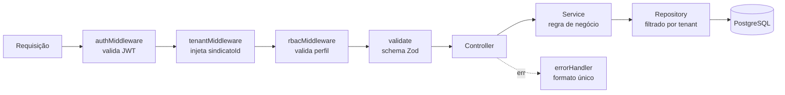
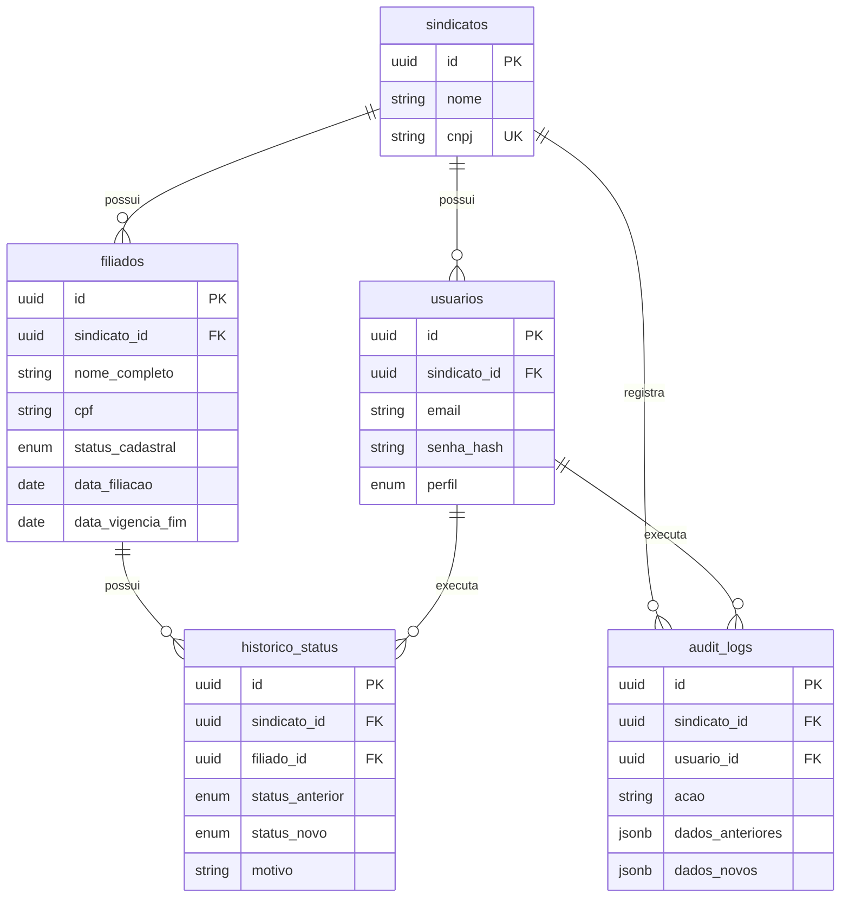
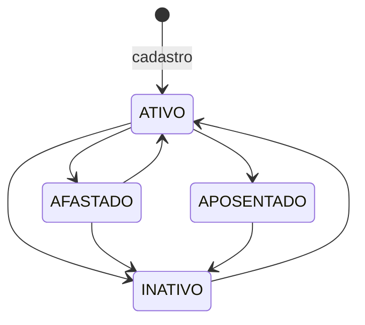

<!--
  README do repositório-vitrine do Sindesk.
  Este repositório é público e NÃO contém código do produto.
  Substitua tudo que estiver marcado como [PREENCHER] antes de publicar.
-->

# Sindesk

**Plataforma SaaS multi-tenant de gestão sindical.** Back-end em Node.js, TypeScript e PostgreSQL.

> 📌 Este é o repositório de **apresentação técnica** do Sindesk. O código-fonte é privado, por se tratar de um produto em comercialização. Aqui estão a arquitetura, o modelo de dados, o contrato da API, as decisões de projeto e uma instância pública para você testar a API você mesmo.
> Código disponível para avaliação técnica mediante solicitação.

[🔗 API em produção](Em breve) · [📘 Documentação Swagger](https://sindesk-api.onrender.com/api/v1/docs) · [🎥 Demonstração em 60s]()

---

## O problema

Sindicatos e associações de classe administram a base de filiados em planilhas. Na prática, isso significa:

- cadastros duplicados, porque nada impede o mesmo CPF de entrar duas vezes;
- vigências de filiação vencendo sem que ninguém perceba;
- nenhum histórico de quem alterou o quê — quando um cadastro muda, a informação anterior simplesmente desaparece;
- nenhum indicador confiável para a diretoria tomar decisão;
- dado pessoal de milhares de trabalhadores circulando em arquivos soltos, sem controle de acesso e sem rastreabilidade.

O último item deixou de ser inconveniência operacional e virou exposição jurídica com a LGPD.

## A solução

Um back-end multi-tenant onde cada entidade sindical opera sobre uma base única, isolada das demais, com controle de acesso por perfil, histórico de alterações e trilha de auditoria de toda operação de escrita.

**Uma instância, muitos sindicatos, zero possibilidade de um enxergar o outro.** Essa frase é o requisito central do produto e organizou praticamente todas as decisões técnicas abaixo.

---

## Experimente

A instância de demonstração tem **dois sindicatos distintos**, propositalmente. Faça login com um e tente alcançar os dados do outro.

| Sindicato | E-mail | Senha | Perfil |
| :--- | :--- | :--- | :--- |
| Metalúrgicos do DF | `admin@metalurgicos.org.br` | `Demo@1234` | ADMIN |
| Metalúrgicos do DF | `secretario@metalurgicos.org.br` | `Demo@1234` | SECRETARIO |
| Metalúrgicos do DF | `assistente@metalurgicos.org.br` | `Demo@1234` | ASSISTENTE |
| Comerciários de Brasília | `admin@comerciarios.org.br` | `Demo@1234` | ADMIN |

> Ambiente de demonstração, com dados fictícios gerados por seed. Os CPFs são matematicamente válidos e não correspondem a pessoas reais.

O Swagger tem o botão **Authorize** configurado — dá para autenticar e testar todos os endpoints direto no navegador.

**Sugestão de roteiro:** autentique como `admin@metalurgicos.org.br`, liste os filiados e copie o `id` de um deles. Depois autentique como `admin@comerciarios.org.br` e tente `GET /api/v1/filiados/{id}` com aquele ID. A resposta é `404`, não `403` — e o motivo dessa escolha está descrito mais abaixo.

---

## Stack

| Camada | Tecnologia |
| :--- | :--- |
| Runtime | Node.js 20 LTS |
| Linguagem | TypeScript |
| Framework | Express |
| Banco | PostgreSQL 15 |
| Acesso a dados | Prisma |
| Validação | Zod |
| Autenticação | JWT (HS256) + bcrypt |
| Testes | Vitest + Supertest, contra PostgreSQL real em container |
| Documentação | OpenAPI 3.0 / Swagger UI |
| Ambiente | Docker + Docker Compose |
| CI | GitHub Actions |
| Deploy | Render + PostgreSQL gerenciado |

---

## Arquitetura

### Organização do código

```text
src/
├── @types/          # tipos globais (extensão do Request do Express)
├── config/          # variáveis de ambiente validadas, conexão de banco
├── modules/
│   ├── auth/
│   ├── filiados/
│   └── dashboard/
│       ├── dtos/            # schemas Zod e contratos de entrada/saída
│       ├── controllers/     # HTTP: recebe, delega, responde
│       ├── services/        # regra de negócio, sem conhecer HTTP
│       └── repositories/    # acesso ao PostgreSQL, sem conhecer regra
├── shared/
│   ├── errors/      # AppError e subclasses
│   ├── middlewares/ # auth, tenant, rbac, validate, errorHandler
│   └── utils/       # validador de CPF, matriz de transição de status
├── app.ts
└── server.ts
```

### Ciclo de uma requisição



---

## Decisões de arquitetura

Esta é a parte que importa. Cada decisão abaixo tinha alternativas viáveis; o que segue é o que foi escolhido e por quê.

### 1. Multi-tenancy por discriminador, e não por schema ou banco separado

**Alternativas consideradas:** um banco por sindicato; um schema PostgreSQL por sindicato; uma coluna discriminadora `sindicato_id` em todas as tabelas.

**Escolhido:** coluna discriminadora.

Banco por tenant dá o isolamento mais forte, mas cada novo cliente vira provisionamento de infraestrutura e cada migração precisa rodar N vezes. Para um produto que pretende vender para sindicatos pequenos e médios, o custo operacional inviabiliza o modelo antes do décimo cliente.

Schema por tenant fica no meio-termo e teria funcionado, mas ainda multiplica migrações e complica consultas administrativas entre tenants.

O discriminador tem o menor custo operacional e a maior facilidade de evolução. **O preço é claro: o isolamento passa a depender de disciplina de aplicação, não de fronteira física.** Um `WHERE` esquecido vaza dados. As duas decisões seguintes existem para pagar esse preço.

### 2. O `sindicatoId` vem exclusivamente do token — e a assinatura dos métodos força isso

O `sindicatoId` nunca chega pelo corpo, pela query string ou por header. Ele é extraído das claims do JWT pelo `tenantMiddleware` e injetado no contexto da requisição. Se o cliente enviar um `sindicatoId` no payload, ele é ignorado.

Mas confiar em disciplina não basta. Por isso todo método de repositório recebe o tenant como **primeiro parâmetro obrigatório**:

```ts
async findManyByTenant(sindicatoId: string, filtros: FiltrosFiliado): Promise<Filiado[]>
async findByIdInTenant(sindicatoId: string, id: string): Promise<Filiado | null>
```

Esquecer o filtro deixa de ser um bug silencioso em produção e vira erro de compilação. A garantia migra de "lembrar" para "o compilador não deixa".

### 3. Recurso de outro tenant responde 404, nunca 403

Um `403 Forbidden` significa "existe, mas você não pode". Isso confirma a existência do registro — e permite a alguém, iterando IDs, descobrir quais filiados existem em outros sindicatos, mesmo sem ler nenhum dado.

Do ponto de vista de um tenant, um recurso de outro tenant **não existe**. A API responde `404`.

### 4. Trilha de auditoria na mesma transação da escrita

O log de auditoria não é gravado depois nem de forma assíncrona. Ele acontece dentro da mesma transação:

```ts
await prisma.$transaction(async (tx) => {
  const filiado = await tx.filiado.create({ data: { ...dados, sindicatoId } });
  await tx.auditLog.create({ data: { sindicatoId, usuarioId, acao: 'INSERT', /* ... */ } });
  return filiado;
});
```

Se a auditoria falhar, a operação inteira sofre rollback. Um sistema que grava o dado e perde o rastro é pior do que um que não grava nada: produz alteração sem responsável, que é exatamente o cenário que a LGPD existe para evitar.

### 5. Prisma no acesso a dados, SQL cru nas agregações

O CRUD usa Prisma: tipagem derivada do schema, migrações versionadas, menos código repetitivo.

As métricas do dashboard usam SQL escrito à mão, com agregação condicional numa única varredura:

```sql
SELECT
  COUNT(*)                                                   AS total_filiados,
  COUNT(*) FILTER (WHERE status_cadastral = 'ATIVO')         AS filiados_ativos,
  COUNT(*) FILTER (WHERE data_filiacao >= date_trunc('month', CURRENT_DATE))
                                                             AS novas_filiacoes_mes,
  COUNT(*) FILTER (WHERE status_cadastral = 'ATIVO'
    AND data_vigencia_fim BETWEEN CURRENT_DATE AND CURRENT_DATE + INTERVAL '30 days')
                                                             AS vencimentos_30_dias
FROM filiados
WHERE sindicato_id = $1;
```

Expressar isso com o ORM produziria sete consultas separadas ou uma construção bem menos legível. ORM para o que é repetitivo, SQL para o que é analítico.

### 6. Unicidade de CPF garantida no banco, não só na aplicação

A verificação prévia em código existe para devolver um erro claro, mas ela tem condição de corrida: duas requisições simultâneas com o mesmo CPF podem passar as duas pela checagem antes de qualquer `INSERT` acontecer.

A garantia real é a constraint `UNIQUE (sindicato_id, cpf)`. A aplicação captura a violação (código `23505` do PostgreSQL) e a converte no mesmo `409 DUPLICATE_CPF`, em vez de deixar virar um `500`.

Note que a constraint é **composta com o tenant**: o mesmo CPF pode existir no Sindicato A e no Sindicato B, porque uma pessoa pode legitimamente ser filiada a dois sindicatos.

### 7. Índice GIN com trigramas para a busca por nome

A busca de filiados usa `ILIKE '%termo%'`. Padrão com `%` no início não é atendido por índice B-tree — a consulta cai em varredura sequencial.

```sql
CREATE EXTENSION IF NOT EXISTS pg_trgm;
CREATE EXTENSION IF NOT EXISTS btree_gin;

CREATE INDEX idx_filiados_sindicato_nome_trgm
    ON filiados USING gin (sindicato_id, nome_completo gin_trgm_ops);
```

Nos volumes atuais a diferença é imperceptível. A escolha foi feita agora porque trocar estratégia de índice depois, com dado de cliente em produção, custa muito mais caro do que acertar no início.

### 8. JWT de 8 horas, sem refresh token

Refresh token exige armazenamento, rotação, revogação e uma superfície de ataque adicional. Para um sistema onde o operador trabalha em jornada administrativa, um token de 8 horas resolve o caso de uso real com uma fração da complexidade.

Está no roadmap para quando houver acesso pelo próprio filiado, que tem padrão de uso diferente.

---

## Modelo de dados



Toda tabela de dados de negócio carrega `sindicato_id NOT NULL` com chave estrangeira para `sindicatos`. Não há exceção — é o que torna o invariante verificável por inspeção do schema.

---

## API

Base: `/api/v1`. Contrato completo no [Swagger](https://sindesk-api.onrender.com/api/v1/docs).

| Método | Rota | Perfis |
| :--- | :--- | :--- |
| `GET` | `/health` | público |
| `POST` | `/auth/login` | público |
| `GET` | `/auth/me` | todos |
| `POST` | `/filiados` | ADMIN, SECRETARIO |
| `GET` | `/filiados` | todos |
| `GET` | `/filiados/:id` | todos |
| `PATCH` | `/filiados/:id/status` | ADMIN, SECRETARIO |
| `GET` | `/dashboard/metrics` | ADMIN, TESOUREIRO |

### Perfis de acesso

| Perfil | O que faz |
| :--- | :--- |
| `ADMIN` | Acesso total ao sindicato |
| `SECRETARIO` | Cadastro, edição e mudança de status de filiados |
| `ASSISTENTE` | Somente consulta |
| `TESOUREIRO` | Consulta e indicadores gerenciais |

### Erros

Formato único em toda a API, tratado por um `errorHandler` central. Nenhum controller formata erro.

```json
{
  "status": "error",
  "statusCode": 409,
  "message": "CPF já cadastrado para este sindicato.",
  "code": "DUPLICATE_CPF",
  "timestamp": "2026-08-23T16:35:00.000Z"
}
```

`VALIDATION_ERROR` · `INVALID_CPF` · `INVALID_STATUS_TRANSITION` · `INVALID_CREDENTIALS` · `TOKEN_MISSING` · `TOKEN_INVALID` · `FORBIDDEN_RESOURCE` · `RESOURCE_NOT_FOUND` · `DUPLICATE_CPF` · `INTERNAL_ERROR`

### Máquina de estados do filiado



Transições são declaradas como estrutura de dados e validadas no serviço. Toda mudança exige motivo e gera registro em `historico_status` e em `audit_logs`.

---

## Testes

Suíte em Vitest + Supertest, executada contra **PostgreSQL real em container** — não mock, não SQLite. O valor central do sistema depende de constraints, índices e cláusulas `WHERE`; um banco simulado testaria a simulação.

O primeiro teste escrito no projeto foi o de isolamento entre tenants, e ele verifica quatro superfícies:

```ts
it('não expõe filiado do Sindicato A para operador do Sindicato B', async () => {
  // 1. não aparece na listagem
  // 2. acesso direto por ID devolve 404 (não 403)
  // 3. PATCH de status não alcança o registro
  // 4. as métricas do dashboard não o contabilizam
});
```

O quarto item é o que costuma escapar. É comum blindar as rotas de leitura e deixar a consulta de agregação sem o filtro de tenant — o vazamento acontece pelo número no dashboard, não pela lista.

Metas de cobertura: 100% em middlewares e utilitários de regra, 90% em services, mínimo de 70% global.


---

## Limitações conhecidas

Nenhum sistema está pronto, e listar o que falta vale mais do que omitir.

| Limitação | Situação |
| :--- | :--- |
| CPF armazenado sem criptografia em repouso | Fase 2 |
| Sem anonimização / direito ao esquecimento | Fase 2 |
| Sem política formal de retenção e expurgo | Fase 2 |
| Imutabilidade de `audit_logs` garantida por convenção de código, não por privilégio de banco | Fase 2 |
| Rate limit em memória — não funciona com múltiplas instâncias | Fase 2 (store compartilhado) |
| E-mail único por sindicato gera ambiguidade no login quando a mesma pessoa opera em dois | Resolução simplificada no MVP |
| Sem refresh token | Decisão consciente para o perfil de uso atual |

O produto **não** se anuncia como "adequado à LGPD". Ele implementa controle de acesso, isolamento entre controladores e trilha de auditoria — que são parte da adequação, não a adequação inteira.

---

## Roadmap

**Fase 1 — Núcleo** ✅
Autenticação, isolamento multi-tenant, RBAC, cadastro e consulta de filiados, mudança de status com histórico, métricas, trilha de auditoria.

**Fase 2 — Cadastro completo**
Vínculos profissionais com histórico de empregadores, edição completa do cadastro, renovação de vigência, relatórios exportáveis em CSV, anonimização para LGPD.

**Fase 3 — Financeiro**
Mensalidades, emissão de boletos, conciliação bancária, gestão de inadimplência.

**Fase 4 — Portal do filiado**
Autoatendimento, carteirinha digital, segunda via de mensalidade.

**Fase 5 — Comunicação e assembleias**
E-mail transacional, WhatsApp Business, registro de presença e votação digital.

---

## Método

O projeto é conduzido em **Spec-Driven Development**: nenhuma funcionalidade é implementada antes de ter especificação escrita — requisitos funcionais com critérios de aceite em Gherkin, requisitos não funcionais, modelo de dados e contrato da API.

Não é formalidade. Em um projeto de duas pessoas, com tempo limitado e trabalho em paralelo, a especificação é o que evita retrabalho por interpretação divergente e o que permite retomar o contexto depois de uma semana sem tocar no código.

O corte do MVP também seguiu esse método: o escopo foi fatiado **na vertical** — poucos endpoints, mas cada um atravessando todas as camadas até o deploy — em vez de na horizontal, que produziria muitas entidades e nenhum sistema funcionando.

---

## Autoria

Projeto desenvolvido em dupla.

**Alan Gabriel Araujo dos Reis** — back-end: modelagem de dados, API, autenticação e RBAC, isolamento multi-tenant, trilha de auditoria, testes, containerização e deploy.
[LinkedIn](https://www.linkedin.com/in/alan-gabriel-araujo/) · [GitHub](https://github.com/Alanado)

**João Alcântara** — front-end: Em desenvolvimento.
[LinkedIn](www.linkedin.com/in/joão-vítor-oliveira-de-alcantara-a53695339) · [GitHub](https://github.com/vittoralcan)

---

## Sobre o código-fonte

O repositório de implementação é privado porque o Sindesk é um produto em comercialização.

Este repositório existe para tornar as decisões técnicas verificáveis mesmo assim: a arquitetura está descrita, o contrato da API está publicado, a instância de demonstração está no ar e pode ser testada por qualquer pessoa.

Para avaliação técnica com acesso ao código, entre em contato: **alan360gabriel@gmail.com**
